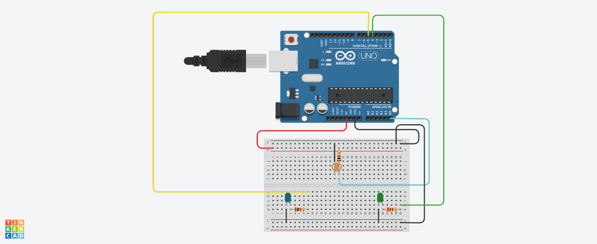

# Curso-Extensao-IoT-Iniciantes
Curso de Extensão IoT para iniciantes

1) Projeto Pisca Pisca Leds: realizado no dia 3/9/2022 com o professor Poyatos no tinkercad.

<a href="piscapisca.ino.txt"><Clique aqui para o código do arduino físico</a>

<a href="Bodacious Hillar.brd"><Clique aqui para o código do tinkercad</a>

_________________________________________________________________________

2) Projeto com Fotorresistor: realizado no dia 10/9/2022 com o professor Poyatos no tinkercad.

Na programação em blocos, utilize assim:

